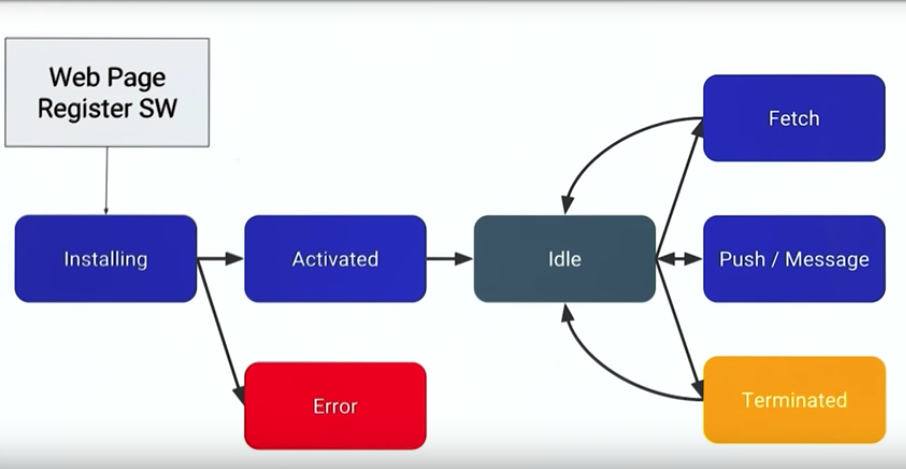

# Service Worker

> Needs https, but can work in localhost in development phase.

> The same service-worker is shared for all the tabs.

> Generally service-workers are kept in the root so they have access to all the routes.

Currently works in:

+ Firefox
+ Chrome
+ Opera

Doesn't work in:

+ IE / Edge
+ Safari

## LifeCycle



## Tools

```
chrome://serviceworker-internals/
```

## Initialization

```js
if ('serviceWorker' in navigator) {
    navigator.serviceWorker.register('/service-worker.js')
        .then(
            function (registration) {
                console.log('Service Worker Registered', registration);
            }
        );
});
```

## Caching The App Shell

```js
var cacheName = 'weatherPWA';
var filesToCache = [];

self.addEventListener('install', function (e) {
    console.log('[ServiceWorker] Install')
    e.waitUntil(
        caches.open(cacheName).then(function (cache) {
            console.log('[ServiceWorker] Caching app shell');
            return cache.addAll(filesToCache);
        })
    );
});
```

## Remove Cache from a Previous Installation

+ we need to update the cache key
+ When we update just a file, we end up downloading all the files in the cache.


```js
self.addEventListener('activate', function (e) {
    console.log('[ServiceWorker] Activate');
    e.waitUntil(
        caches.keys().then(function (keyList) {
            return Promise.all(keyList.map(function (key) {
                console.log('[ServiceWorker] Removing old cache', key);
                if (key !== cacheName) {
                    return caches.delete(key);
                }
            }))
        })
    );
});
```

## Intercepting Fetches

```js
self.addEventListener('fetch', function (e) {
    console.log('[ServiceWorker] Fetch', e.request.url);
    e.respondWith(
        caches.match(e.request).then(function (response) {
            return response || fetch(e.request);
        })
    );
});
```

